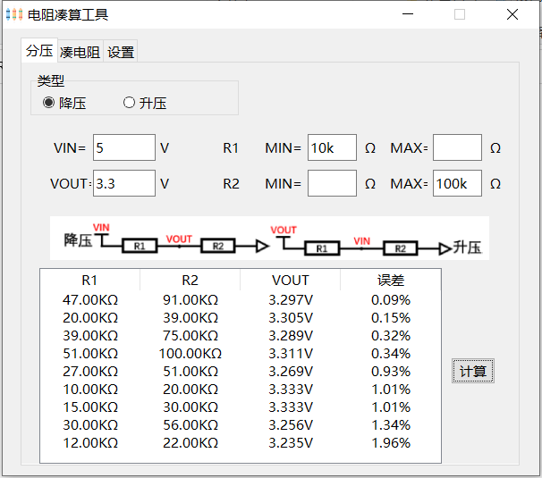
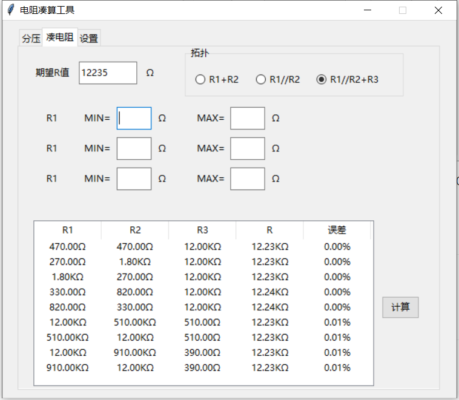
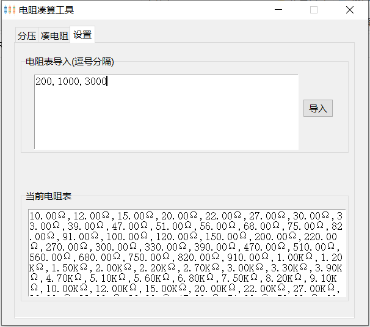

本工具用于电阻凑算，使用Python3开发，GUI使用Tkinter，无第三方依赖。

# 使用方法

## 计算分压电阻值

给定输入、输出电压，计算所需电阻比，根据电阻表选取最接近的电阻组合。

支持约束阻值范围，支持填写带单位的电阻值（如1000欧可填1000，1k，1K，0.001M），不填表示无约束。支持升压、降压两种拓扑。

## 凑电阻

通过电阻串并联凑出期望阻值。支持三种拓扑。

## 设置

可对程序使用的电阻表进行设置，如：

默认的电阻表来自某宝0402电阻包。

# 打包

本项目仅依赖Python3标准库。使用pyinstaller打包可执行文件（见`build.sh`）。

`电阻凑算工具.tk` 是[Tkinter布局助手](https://www.pytk.net/tkinter-helper)导出的布局文件，可重新导入进行修改。

# 参考资料

[Tkinter布局助手](https://www.pytk.net/tkinter-helper)

[Resistor Value and Ratio Calculator](https://jansson.us/resistors.html)